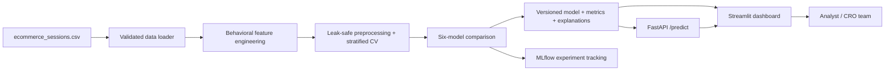
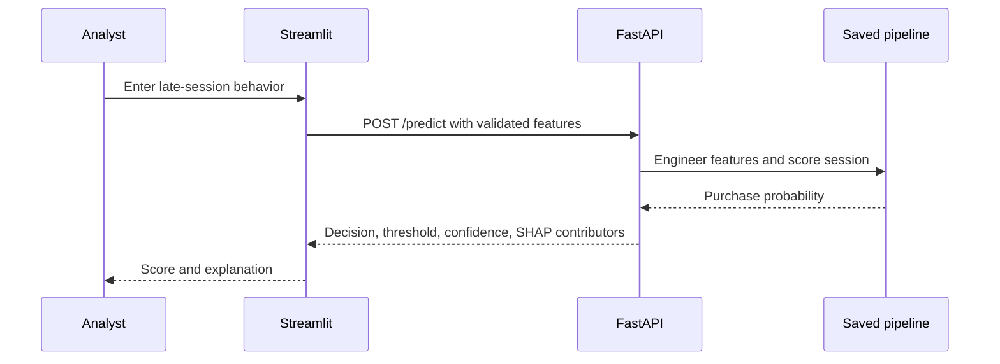

# System architecture

```mermaid
flowchart LR
    CSV[ecommerce_sessions.csv] --> Loader[Validated data loader]
    Loader --> Features[Behavioral feature engineering]
    Features --> CV[Leak-safe preprocessing + stratified CV]
    CV --> Compare[Six-model comparison]
    Compare --> Artifacts[Versioned model + metrics + explanations]
    Artifacts --> API[FastAPI /predict]
    Artifacts --> UI[Streamlit dashboard]
    API --> UI
    UI --> Analyst[Analyst / CRO team]
    Compare --> MLflow[MLflow experiment tracking]
```

Training and serving share the same serialized scikit-learn pipeline. The
dashboard reads saved artifacts and never fits a model.

# Scoring workflow

```mermaid
sequenceDiagram
    participant User as Analyst
    participant UI as Streamlit
    participant API as FastAPI
    participant Model as Saved pipeline
    User->>UI: Enter late-session behavior
    UI->>API: POST /predict with validated features
    API->>Model: Engineer features and score session
    Model-->>API: Purchase probability
    API-->>UI: Decision, threshold, confidence, SHAP contributors
    UI-->>User: Score and explanation
```
